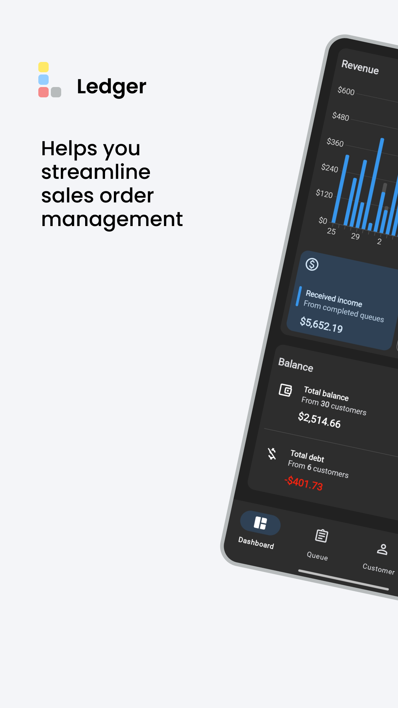
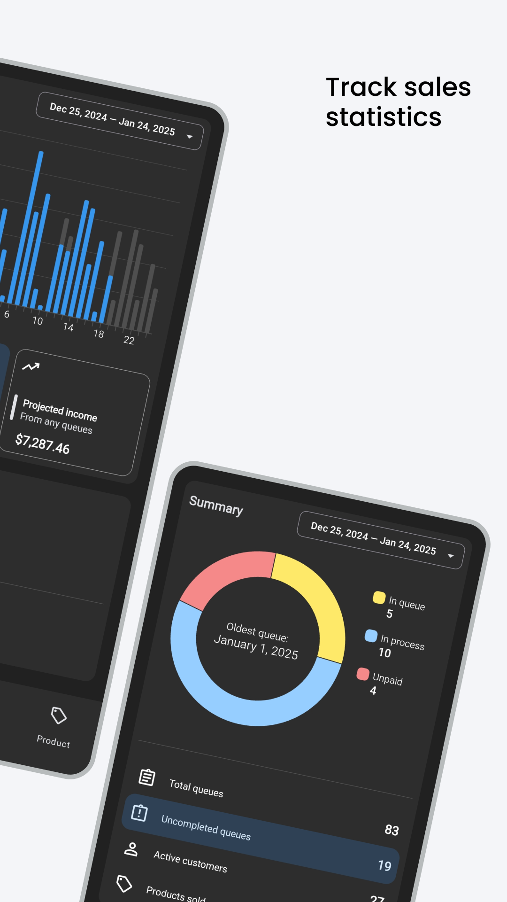
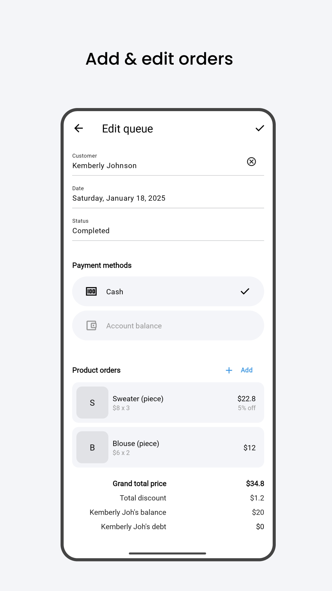

# Ledger for Android

[](https://github.com/robifr/ledger/actions/workflows/build.yaml)
[](https://codecov.io/github/robifr/ledger)

Ledger is an Android app that helps automate sales orders, customer deposits, and debt tracking.
Originally developed to support local shops, it reduces manual work and errors while ensuring
accurate bookkeeping. The app scales to thousands of entries with no performance loss and works
offline by storing all data locally, requiring no internet connection or user logins.

Direct download available below:<br>
<a href="https://github.com/robifr/ledger/releases/latest">
  
</a>

### Table of Contents
<details>
  <summary>Click to expand</summary>  
  <div id="user-content-toc">
    <ul>
      <li>
        <a href="#ledger-for-android">1. Overview</a>
        <ul>
          <li><a href="#screenshots">1.1. Screenshots</a></li>
          <li><a href="#features">1.2. Features</a></li>
          <li><a href="#compatibility">1.3. Compatibility</a></li>
          <li><a href="#permissions">1.4. Permissions</a></li>
        </ul>
      </li>
      <li>
        <a href="#project-setup">2. Project Setup</a>
        <ul>
          <li><a href="#build-instructions">2.1. Build Instructions</a></li>
          <li><a href="#build-variants">2.2. Build Variants</a></li>
          <li><a href="#updating-third-party-licenses">2.3. Updating Third-Party Licenses</a></li>
        </ul>
      </li>
      <li><a href="#architecture">3. Architecture</a></li>
      <li>
        <a href="#tests">4. Tests</a>
        <ul>
          <li><a href="#code-coverage">4.1. Code Coverage</a></li>
        </ul>
      </li>
      <li>
        <a href="#code-style">5. Code Style</a>
        <ul>
          <li><a href="#code-formatting">5.1. Code Formatting</a></li>
          <li><a href="#xml-formatting">5.2. XML Formatting</a></li>
        </ul>
      </li>
      <li><a href="#license">6. License</a></li>
    </ul>
  </div>
</details>

### Screenshots
<div align="center">
  
  
  
  
  
</div>

### Features
- Sort, filter, and search functionality.
- Visualized charts and statistics.
- Supports English (US) and Indonesian language.
- Dark theme support.
- Full offline.
- Auto-updates with new releases from GitHub.

### Compatibility
- Minimum SDK: 30 (Android 11)
- Target SDK: 35 (Android 15)
- Orientations supported: Portrait and landscape

The app has been tested on Android 13 (SDK 33) using a physical device and on Android 15 (SDK 35)
through an emulator. If you encounter any issues, please report them by opening a GitHub issue.

### Permissions
Required:
- `MANAGE_EXTERNAL_STORAGE`: Persist data in external storage (documents directory) even after app
  uninstallation.

Optional:
- `ACCESS_NETWORK_STATE` and `INTERNET`: Check and download app updates from GitHub.
- `REQUEST_INSTALL_PACKAGES`: Install the downloaded app updates from GitHub.

## Project Setup
### Build Instructions
1. Install [Android Studio](https://developer.android.com/studio) and make sure the Android SDK is
  downloaded during setup.

2. Install [JDK 17](https://adoptium.net/temurin/releases/?version=17) as this project requires it.
  Android Studio may bundle its own JDK, but you can configure it to use JDK 17 by following this
  [Gradle JDK configuration guide](https://developer.android.com/build/jdks#jdk-config-in-studio).
  Additionally, set the `JAVA_HOME` environment variable to the JDK 17 installation directory.

3. Clone this repository and navigate to the project directory:
    ```
    git clone https://github.com/robifr/ledger.git
    cd ledger
    ```

4. Install [Python 3](https://www.python.org/downloads/) and set up the virtual environment for
  generating third-party licenses:
    ```
    ./gradlew setupPythonEnvironment
    ```

5. Create `keystore.p12` file to sign the app:
    ```
    keytool -genkeypair -v -keystore <keystore_path> -storetype PKCS12 -keyalg RSA -keysize 2048 -validity 10000 -alias <keystore_alias>
    ```
    Replace `<keystore_path>` with a relative path like `./keystore.p12` and `<keystore_alias>` with
    your chosen alias. Use a secure password when prompted.

6. Create a `keystore.properties` file in the project root directory and add the following content:
    ```properties
    key.alias=<keystore_alias>
    key.password=<keystore_password>
    key.storeFile=<keystore_path>
    key.storePassword=<keystore_password>
    ```
    Replace the placeholders with the values you used when creating the keystore. Since PKCS12
    keystore is being used, `key.password` and `key.storePassword` should be the same.

> [!CAUTION]
> Keep the `keystore.p12`, `keystore.properties` file, and its credentials private. Don't commit
  them to version control.

7. Sync dependencies:
    ```
    ./gradlew build
    ```

8. It's recommended to run the [automated tests](#tests) before building the app. If everything is
    successful, build the app:
    ```
    ./gradlew assembleRelease
    ```
    The generated APK will be located in the `app/build/outputs/apk/release/` directory.

### Build Variants
- **debug**: The default for development. It's fully debuggable and includes tools like [LeakCanary](https://github.com/square/leakcanary)
  for troubleshooting.
- **qa**: Similar to the release build, but with a different database location and prepopulated data
  for testing in a near-production setup.
- **release**: The final production version, optimized for stability and performance. This build is
  signed and minified.

Use `./gradlew assemble<VariantName>` to build different variants: `Debug`, `Qa`, or `Release`.

### Updating Third-Party Licenses
A Python script is used to generate a raw formatted text file for third-party licenses, which is
displayed on the **About** > **Third-Party Licenses** screen.

Always ensure that third-party licenses are up-to-date whenever the dependencies change:  
```
./gradlew licensee
```
This command collects licenses for the dependencies. However, some third-party licenses that fall
outside the Gradle ecosystem can't be obtained by [Licensee](https://github.com/cashapp/licensee).
To address this, you need to manually add those licenses in the `unlisted_libraries()` function
within [`format_licensee.py`](./scripts/format_licensee.py). Then, re-run the above command to
reflect the updates.

## Architecture
This project follows the **MVVM (Model-View-ViewModel)** architecture pattern. Detailed information
about the architecture is covered in the [ARCHITECTURE.md](./docs/ARCHITECTURE.md) file.

## Tests
This project includes both unit tests and Android instrumentation tests. These tests focus on the
critical sections of the code, such as the **ViewModel** and **Model** layers, as this project uses
the MVVM architecture.

- **Unit tests** are located in [`app/src/test/`](./app/src/test). Some tests use fake objects to
  simulate real dependencies, like when performing database transactions in the repository layer.
  This approach is simpler than mocking numerous components. Run them with:
  ```
  ./gradlew testDebugUnitTest --rerun-tasks
  ```
  The `--rerun-tasks` flag forces Gradle to re-run the tests and avoid using cached results.

- **Android instrumentation tests** are located in [`app/src/androidTest/`](./app/src/androidTest)
  and require a [compatible physical device or emulator](#compatibility). Run them with:
  ```
  ./gradlew connectedDebugAndroidTest
  ```

### Code Coverage
Code coverage reports can also be generated using [JaCoCo](https://github.com/jacoco/jacoco). Always
run `./gradlew clean` before generating the reports to remove any stale data. Then run:
```
./gradlew testDebugUnitTest --rerun-tasks jacocoDebugUnitTestReport
./gradlew connectedDebugAndroidTest jacocoDebugAndroidTestReport
./gradlew jacocoMergeDebugReport
```
The merged HTML and XML reports, which combine both the unit test and Android test reports, will be
generated in `app/build/reports/jacoco/jacocoMergeDebugReport/`.

## Code Style
For Kotlin code, we follow [Kotlin coding conventions](https://kotlinlang.org/docs/coding-conventions.html)
with these project-specific additions:
- Use explicit types on the left-hand side (LHS) of variable, property, or method declarations.
- Treat platform types as nullable and specify their type explicitly.
- Use an underscore (`_`) prefix for private, protected or internal properties and methods.

### Code Formatting
[Spotless](https://github.com/diffplug/spotless) is used to enforce the code style. To
format all files according to the project's style, run:
```
./gradlew spotlessApply
```
This will format the code and add the header license to files with the following extensions:
`.java`, `.kt`, `.gradle.kts`, `.js`, and `.html`. While for `.py` files, only the header license
will be added, due to Spotless requirement to install `black` formatter.

### XML Formatting
For `.xml` files, only the header license will be added by Spotless. We use the Android Studio
formatter for these files, which is configured in the `.idea/codeStyles/` directory. To apply it:
- Go to **Settings** > **Editor** > **Code Style**.
- Click the **Scheme** dropdown and select **Project**.
- Alternatively, use the **Import Scheme** option next to the dropdown to import
  `.idea/codeStyles/Project.xml` if it isn't already applied.

To format the file, right-click on the file or the directory containing it and select
**Reformat Code**.

## License
Ledger is distributed under the terms of the Apache License, Version 2.0. For more information, see
the [LICENSE](LICENSE) file.

Copyright 2024 Robi
